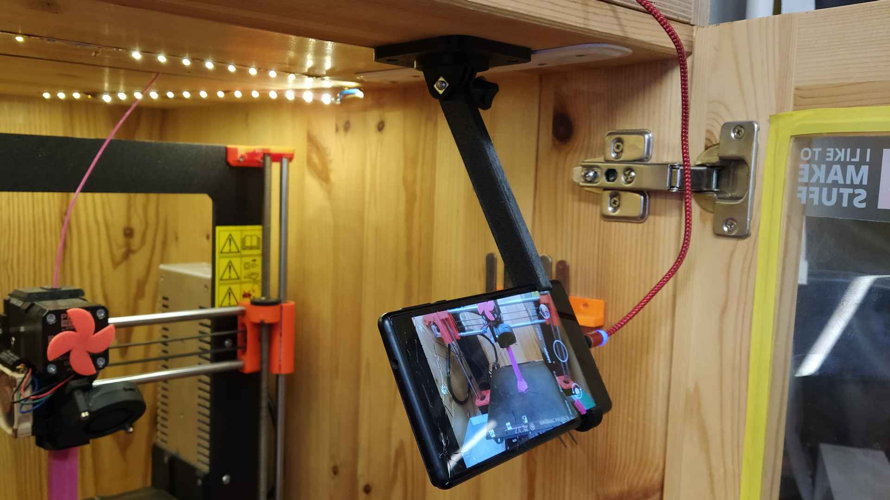

# GoPro Mounts OpenSCAD Library

This library contains modules to include accessory mounts and screw handles compatible with GoPro. This type of mounts and holders seems to be kind of standard nowadays. You can use it to mount anything to anything, with one or both parts of the joint 3D printed. To join the parts together a simple M5 screw and nut (square nut, preferrably) is required.

The above photograph shows example models _flat surface rotational mount_ and _phone holder_ for timelapse photography during 3D print.

## Samples

In the `Samples` folder there is bunch of useful models, showcasing the library functions:

* [`extension_arm.scad`](Samples/extension_arm.scad) is simple M-F extension arm with variable length.
* [`flat_surface_rotational_mount.scad`](Samples/flat_surface_rotational_mount.scad) is two-part mount that can be screwed to flat surface and offers rotational mount.
* [`phone_holder.scad`](Samples/phone_holder.scad) is a parametric holder for any cell phone, with or without cover.
* [`screw_handle.scad`](Samples/screw_handle.scad) is just a simple handles model for M5x50 screws with hex- and flat heads.
* [`tripod_mount.scad`](Samples/tripod_mount.scad) is a mount for tripods with conical square adapters.

## Modules

The following modules are available. All have sensible defaults and in most cases you won't need to use any arguments, maybe except `center`.

### gopro_mount_m

Will create the male mount connector (the one usually found on the camera or camera case).

    gopro_mount_m(
        base_height = 3, 
        base_width = 20, 
        leg_height = 17, 
        center = false)

* `base_height`, `base_width` = dimensions of the base plate, depth is always 9.5.
* `leg_height` = height of the legs. Do not change unless you really have to.
* `center` = if set to `false` (default), the model will be centered on X and will begin on Y and Z origins. If set to `true`, the Y will be centered on mounting axis.

### gopro_mount_f

Will create the female mount connector (the one usually found on the tripod/holder part).

    gopro_mount_f(
        base_height = 3, 
        base_width = 24, 
        leg_height = 17, 
        nut_diameter = 11.5, 
        nut_sides = 4, 
        nut_depth = 3, 
        center = false);

* `base_height`, `base_width` = dimensions of the base plate, depth is always 19 mm.
* `leg_height` = height of the legs. Do not change unless you really have to.
* `nut_diameter`, `nut_depth`, `nut_sides` = parameters of the embedded nut. Default to M5 square nut. Set `nut_depth = 0` to omit the nut guard.
* `center` = if set to `false` (default), the model will be centered on X and will begin on Y and Z origins. If set to `true`, the Y will be centered on mounting axis (which is not axis of the model itself).

### gopro_screw_handle

Will create a screw handle for M5 screw to hold the parts together. Usually, M5x50 screws are ideal.

    gopro_screw_handle(
        screw_length = 50,
        total_length = 0, 
        hex_head = true);

* `screw_length` = length of the M5 screw thread. Usually it's the nominal length (for M5x50 it's `50`). For flat and oval heads you usually need to add about 3 mm (so Mx50 with flat head would require `screw_length = 53`).
* `total_length` = total length of the handle. Set to `0` (default) to generate it automatically based on screw length.
* `hex_head` = type of screw head. If set to `true`, screw with hexagonal head is expected and the head hole will therefore have hexagonal shape. If set to `false`, other head types (usually flat) is expected. The head hole will be round and the screw hole will be slightly smaller so the threads will have something to bite into.

## Legal

* This project is created and maintained by [Michal Altair Valášek](https://www.rider.cz/).
* The code is licensed under the terms of the [MIT License](LICENSE).
* This project adheres to [No Code of Conduct](CODE_OF_CONDUCT.md). We are all adults. We accept anyone's contributions. Nothing else matters.